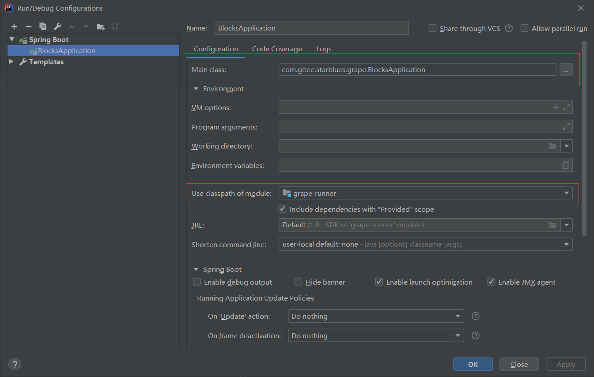
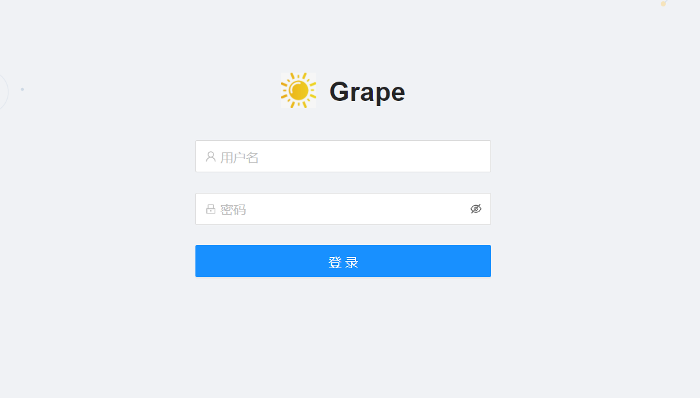
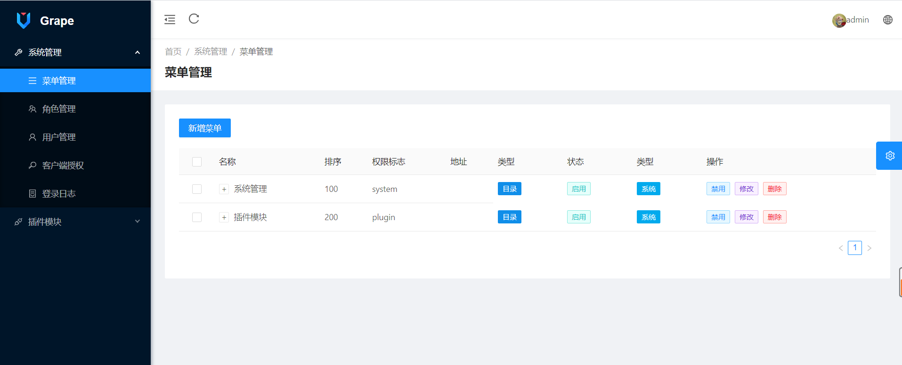
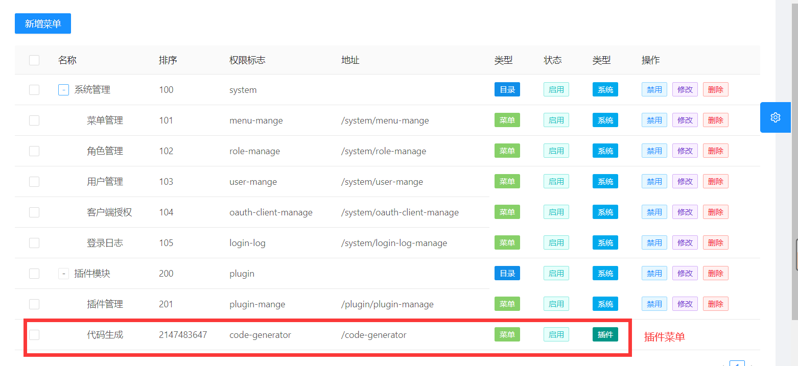
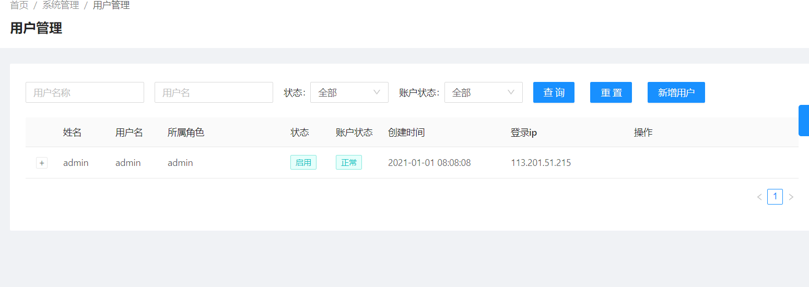
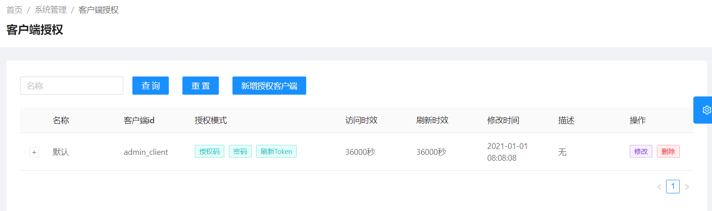
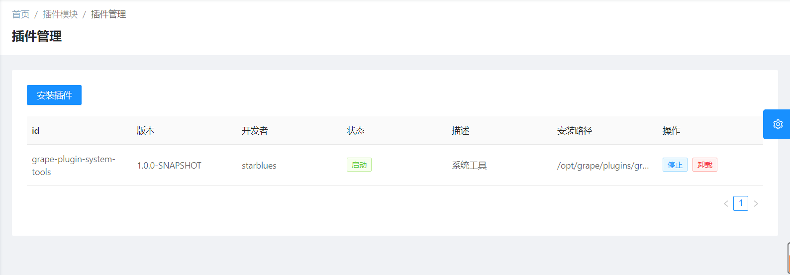
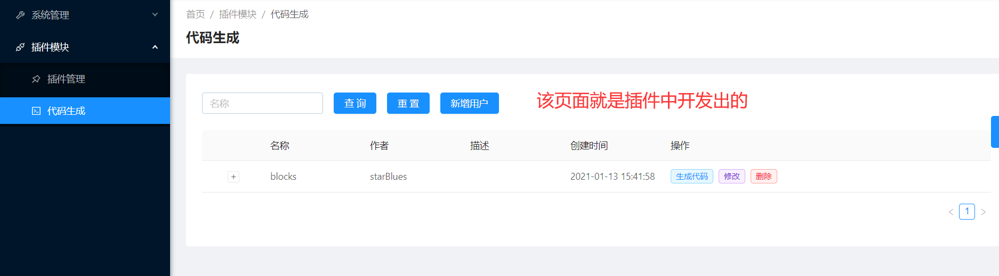

# Grape

#### 介绍
市场上的后台管理系统其实比较多的, 但是用于可插件化开发的后台管理系统几乎没有, 但是又特别需要, 因为它在系统扩展方面是比较友好的, 
在不影响核心逻辑, 就可以拓展出系统的额外功能, 就类似于`Google浏览器`、`Idea`的插件拓展一样。
所以基于该原因开源了一套可插件化开发的后台管理系统, 系统主要是基于市场主流的`SpringBoot` + `Vue` 前后端分离形式开发的; 系统
已经内置了一套成熟的`用户-角色-权限-菜单`管理机制, 使用者就无需开发这套每个系统都需要的功能, 只需关注各个项目中的核心功能和插件拓展功能即可, 
致力于开发者可快速的开发出可插件开发的后台管理系统。

#### 特色
- `SpringBoot` + `Vue` 前后端分离形式
- 成熟完善的`用户-角色-权限-菜单`管理机制
- 可在后端进行插件化开发, 可在插件中开发接口、开发前端扩展
- 可在插件中使用`Vue`进行拓展开发, 并且支持动态插入导航菜单
- 插件中支持`Mybatis`、`Mybatis-Plus`、`Tk-Mybatis`对不同数据库的访问
- 插件中支持`Thymeleaf`

##### 文档地址
[文档地址](http://www.starblues.cn:8000/)

##### 演示地址
[演示地址](http://starblues.ccsert.top:9000/web)
- 用户名密码: admin/123456

#### 快速体验
1. 下载运行包`grape.zip`

- <a href="https://gitee.com/starblues/grape/attach_files" target="_blank">进入下载页</a>

2. 初始化数据库
- 新建数据库: `grape`
- 导入sql文件: `sql/grape.sql`

3. 修改数据库连接
- 打开 `application.yml` 文件
- 修改数据库连接, 配置数据库连接信息, 如下:
```yaml
 datasource:
    url: jdbc:mysql://localhost:3306/grape?useUnicode=true&characterEncoding=utf8&useSSL=false&serverTimezone=UTC&allowPublicKeyRetrieval=true
    username: root
    password: root
```
4. 启动项目执行

执行`startup.cmd`或者`startup.sh` 启动项目

5. 访问界面: `http://127.0.0.1/web`
默认用户名密码: `admin/123456`

#### 目录说明
```text
bin: 生成环境启动停止脚本
grape-core: 系统合并模块
    grape-runner: 生产环境运行模块
    grape-server: 主程序模块
    grape-web: 主前端
grape-plugins: 插件模块
    grape-plugin-system-tools: 系统工具插件
sql: sql文件 
```

#### 软件架构
##### 后端
- 基础: SpringBoot 2.4.2
- 安全: SpringSecurity+JWT+Oauth2
- 接口文档: Swagger2
- 持久层: Mybatis+Mybatis-Plus
- 插件框架: Springboot-Plugin-Framework 2.4.0
##### 前端
- 基础: Vue+Antdv+AntdvPro
- 微前端: Qiankun
##### 数据库
- Mysql

#### 内置功能
1. OAuth2认证
2. Swagger2.0接口文档
3. 用户管理: 对系统登录的用户进行管理
4. 角色管理: 对系统用户所属角色进行管理, 并且可以进行权限分配
5. 菜单权限管理: 对系统的菜单权限进行管理, 可设置菜单展示顺序和层级关系
6. 授权客户端管理: 管理外部系统的授权信息, 用于来访问系统接口 
7. 登录日志: 可展示出每个用户的登录日志
8. 插件管理: 对系统扩展的插件进行动态的安装、卸载、启动、停止
9. 后端插件: 根据插件框架进行系统的扩展开发, 可在插件中开发接口、开发对数据库的操作、开发前端扩展
10. 前端插件: 根据预留的扩展方式, 在插件中扩展出前端插件
11. 插件扩展:
- 代码生成: 根据配置数据来生成对应代码

#### 开发教程

##### 初始化数据库
将 `sql` 文件夹 `grape.sql` 初始化到`mysql`中

##### 开发环境启动
1. mvn clean install -Dmaven.test.skip=true
2. `grape-server`中配置数据库连接
3. 配置如下

4. 启动

##### 打包生产环境
1. windows下执行: `package.bat`
2. 进入 `dist` 
3. 执行`startup.cmd` 或者 `startup.sh`

##### 插件功能开发文档
[https://gitee.com/starblues/springboot-plugin-framework-parent](https://gitee.com/starblues/springboot-plugin-framework-parent)

##### 演示图
- 登录页面

- 主页面

- 菜单管理页面

- 用户管理页面

- 授权客户端管理页面

- 插件管理页面

- 插件中开发的页面



#### 参与贡献

1.  Fork 本仓库
2.  新建 Feat_xxx 分支
3.  提交代码
4.  新建 Pull Request
